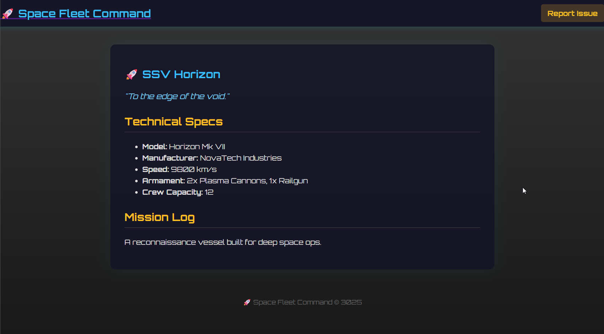
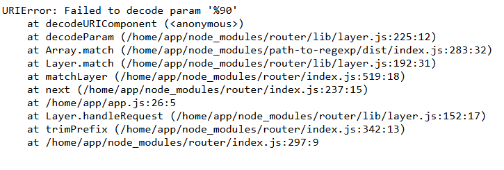

## Overview

Space Fleet Command is a web challenge from 404CTF created by **\_hdrien**. It was released as a "hard" difficulty challenge and has been resolved by 27 players out of over 2500.

In this writeup, I’ll walk you through my thought process, the tools I used, and how I ultimately captured the flag.

## Analysis

First thing first, I started the challenge in a black box way for a simple reason : I absolutely didn't saw that the source code was available. No judgement, I'm proud that I've found a few things in this way haha.

### Pages

The challenge is a web application to manage spaceships and report bugs.

#### Home page

> Route : `/`

On this page there is an input to search for a spaceship by name. It will display the spaceship page in the list if it exists.

#### Report page

> Route : `/report`

On this page there is a form to report a bug. Once you submit the form, it says that an admin will visit the page.

#### Spaceship page

> Route : `/spaceship/:id`

On this page you can see the details on the selected spaceship.

### First tries

I started by trying some simple XSS attacks and SQL injection but it didn't work.

After some research, I succeeded to trigger an error on the `/spaceship/:id` page by using a malformed URL. I used `spaceship/%90` because it's not decoded as a character but I quickly understood that was a rabbit hole.

Then I tried to attack the `/?q=` query parameter and found that I was able to trigger an error by using [HTTP Parameter Pollution](https://owasp.org/www-project-web-security-testing-guide/latest/4-Web_Application_Security_Testing/07-Input_Validation_Testing/04-Testing_for_HTTP_Parameter_Pollution) which is a technique where you put a parameter multiple times with different values. One more time it was a rabbit hole.

It was time to dig onto `/report` page and I had a good feeling about it. When you fill the two input fields you have a request like this ``